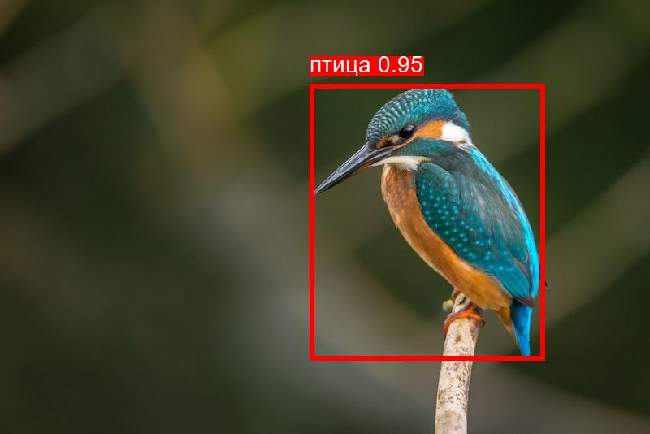
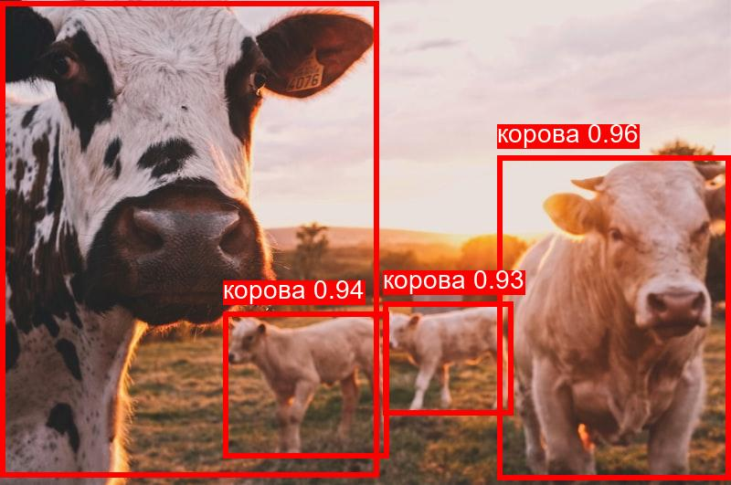
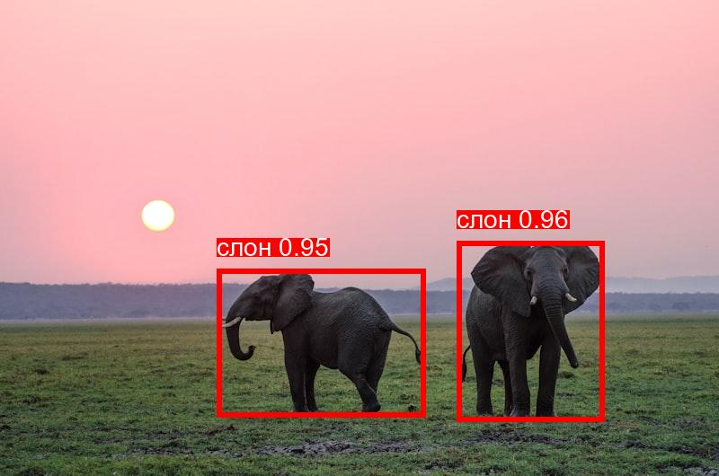

# 🐾 Классификация животных по фотографиям с YOLOv11x

Проект для автоматического обнаружения и классификации животных на изображениях с использованием современной модели **YOLOv11x** от Ultralytics.

## 🚀 Особенности

- **Высокая точность**: Использует YOLOv11x - самую мощную модель из семейства YOLO
- **Быстрая работа**: Оптимизированная архитектура для быстрого инференса
- **COCO Dataset**: Распознает 10 видов животных из стандартного COCO dataset
- **Цветовое кодирование**: Разные цвета рамок в зависимости от уверенности модели
- **Простота использования**: Готовые скрипты для тестирования

## 📋 Требования

- Python 3.8+
- PyTorch 1.8+
- CUDA (опционально, для GPU ускорения)

## 🛠 Установка

1. **Клонируйте репозиторий:**
```bash
git clone https://github.com/ваш-username/Classification_of_animals_by_photo.git
cd Classification_of_animals_by_photo
```

2. **Установите зависимости:**
```bash
pip install -r requirements.txt
```

3. **Загрузите тестовые изображения:**
```bash
python src/download_animal_test_data.py
```

## 🎯 Использование

### Тестирование на всех изображениях

```bash
python src/test_detector.py
```

### Тестирование на одном изображении

```bash
python src/test_single.py data/test/cat1.jpg
```

### Программное использование

```python
from src.animal_detector import AnimalDetector

# Создаем детектор
detector = AnimalDetector()

# Обнаруживаем животных
result_image, animals = detector.detect("path/to/image.jpg")

# Выводим результаты
for animal in animals:
    print(f"{animal['class_ru']}: {animal['confidence']:.2f}")

# Сохраняем результат
detector.save_result(result_image, "result.jpg")
```

## 📸 Примеры работы

<p align="center">Вот несколько примеров работы детектора YOLOv11x на реальных изображениях:</p>

<div align="center">
  <h3>🐦 Обнаружение птицы</h3>
  <p align="center"></p>
</div>

<div align="center">
  <h3>🐄 Обнаружение фермерских животных</h3>
  <p align="center"></p>
</div>

<div align="center">
  <h3>🐘 Обнаружение слона</h3>
  <p align="center"></p>
</div>

<p align="center"><i>На изображениях видны цветные рамки вокруг обнаруженных животных с указанием вида и уверенности модели.<br>
Цвет рамки зависит от уровня уверенности: 🔴 красный (≥80%), 🟠 оранжевый (50-79%), 🟡 желтый (25-49%)</i></p>

## 🐾 Поддерживаемые животные (COCO Dataset)

Модель YOLOv11x обучена на COCO dataset и может распознавать **10 видов животных**:

| Класс | Русское название | Английское название |
|-------|------------------|-------------------|
| 🐦 | Птица | bird |
| 🐱 | Кот | cat |
| 🐶 | Собака | dog |
| 🐴 | Лошадь | horse |
| 🐑 | Овца | sheep |
| 🐄 | Корова | cow |
| 🐘 | Слон | elephant |
| 🐻 | Медведь | bear |
| 🦓 | Зебра | zebra |
| 🦒 | Жираф | giraffe |

> **Примечание**: Животные, не входящие в COCO (лиса, свинья, тигр, лев и др.), будут определяться как наиболее похожий класс из доступных.

## 🎨 Цветовое кодирование

- 🔴 **Красный**: Высокая уверенность (≥80%)
- 🟠 **Оранжевый**: Средняя уверенность (50-79%)
- 🟡 **Желтый**: Низкая уверенность (25-49%)

## 📊 Результаты

Результаты сохраняются в папке `results/` с именами файлов в формате `{original_name}_yolo11x.jpg`.

## 🔧 Технические детали

- **Модель**: YOLOv11x (самая точная версия)
- **Dataset**: COCO (80 классов, 10 животных)
- **Порог уверенности**: 0.25 (настраивается)
- **Размер изображения**: Автоматически масштабируется
- **Формат вывода**: PIL Image с нарисованными рамками

## 📁 Структура проекта

```
Classification_of_animals_by_photo/
├── src/
│   ├── animal_detector.py              # Основной класс детектора
│   ├── test_detector.py               # Скрипт тестирования всех изображений
│   ├── test_single.py                 # Скрипт тестирования одного изображения
│   └── download_animal_test_data.py   # Загрузка тестовых данных
├── data/
│   └── test/                          # Тестовые изображения
├── results/                           # Результаты обработки
├── requirements.txt                   # Зависимости
└── README.md                         # Документация
```

## 🚀 Планы развития

В следующих версиях планируется:

- **Поддержка большего количества животных** (Open Images Dataset, iNaturalist)
- **Специализированные модели** для конкретных видов животных
- **Каскадная классификация** для более точного определения видов
- **Web-интерфейс** для удобного использования

## 🤝 Вклад в проект

Приветствуются любые улучшения! Создавайте Issues и Pull Requests.

## 📄 Лицензия

Этот проект использует лицензию MIT.

## 📞 Контакты

- **Telegram**: [@phantom2059](https://t.me/phantom2059)
- **GitHub**: [phantom2059](https://github.com/phantom2059)

## 🙏 Благодарности

- [Ultralytics](https://ultralytics.com/) за YOLOv11x
- [COCO Dataset](https://cocodataset.org/) за обучающие данные 