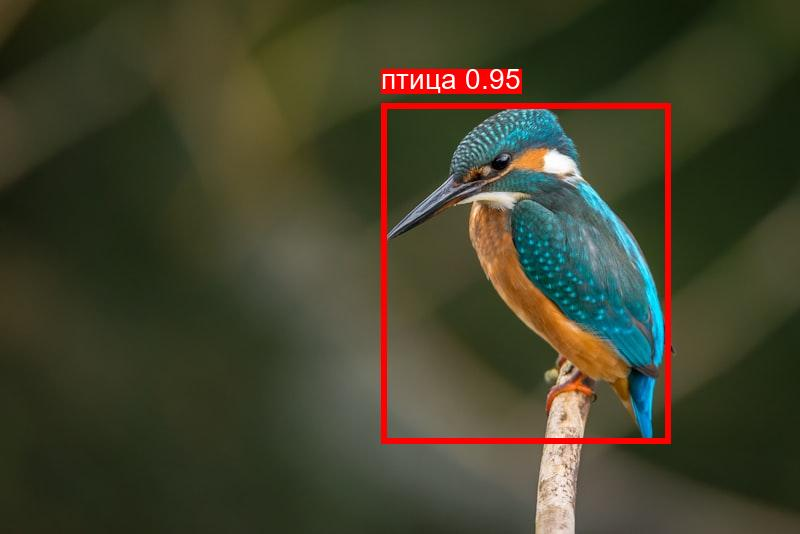
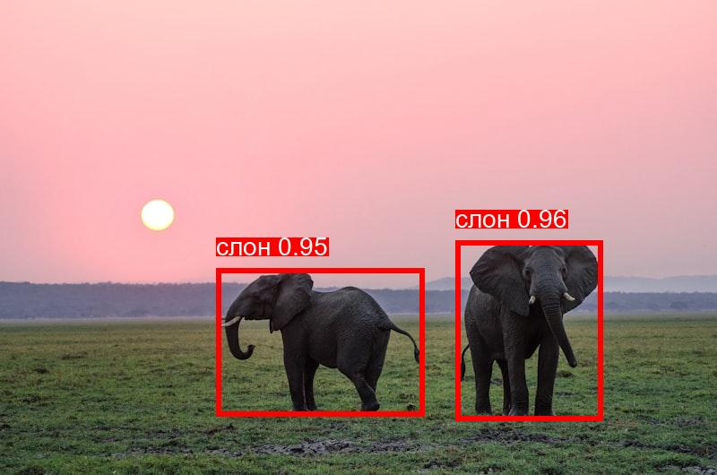
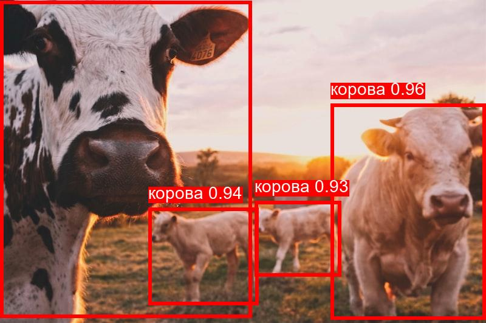

# Animal Classification by Photo

**Детекция и классификация животных на изображениях — двухэтапный пайплайн на YOLOv8**


---

## Overview

Проект для автоматического обнаружения и классификации животных на фотографиях с помощью двухэтапного пайплайна на YOLOv8. Детектор (YOLOv8x, обученный на Open Images Dataset) находит животных и определяет вид среди 72 классов, а классификатор (YOLOv8x-cls, ImageNet) дополнительно подтверждает результат. Все названия переведены на русский язык.

---

## Pipeline

1. **Detection** — YOLOv8x-oiv7 находит bounding boxes и определяет вид животного (72 класса).
2. **Classification** — YOLOv8x-cls классифицирует всё изображение для перекрёстной проверки.
3. **Filtering** — умная фильтрация: при наличии детекций с уверенностью ≥50% низкокачественные результаты подавляются.
4. **Visualization** — цветовое кодирование рамок с подписями на русском языке.

Цвета рамок по уровню уверенности:
- Красный — высокая (≥80%)
- Оранжевый — хорошая (≥50%)
- Жёлтый — удовлетворительная (≥30%)

---

## Quick start

```bash
git clone https://github.com/phantom2059/Classification_of_animals_by_photo.git
cd Classification_of_animals_by_photo
pip install -r requirements.txt
```

Модели (`yolov8x-oiv7.pt`, `yolov8x-cls.pt`) скачиваются автоматически при первом запуске.

### Обработка тестовых изображений

```bash
python -m src.animal_detector
```

### Программное использование

```python
from src.animal_detector import AnimalDetector
from src.animal_classifier import AnimalClassifier

detector = AnimalDetector()
classifier = AnimalClassifier()

result_image, animals = detector.detect("path/to/image.jpg")
for a in animals:
    print(f"{a['class_ru']}: {a['confidence']:.2f}")

predictions = classifier.classify("path/to/image.jpg")
for pred in predictions:
    print(f"{pred['class_en']}: {pred['confidence']:.2f}")

detector.save_result(result_image, "result.jpg")
```

Результаты сохраняются в `data/result/`.

---

## Примеры работы

<p align="center">
  
  &nbsp;&nbsp;
  
</p>

<p align="center">
  
</p>

Примеры детекции: белый медведь (0.99), фермерские животные — 4 коровы (0.94, 0.88, 0.86, 0.86), слоны (0.95, 0.93), лошадь (0.97).

---

## Поддерживаемые классы

72 класса животных из Open Images Dataset:

- **Птицы** (15) — орёл, утка, лебедь, гусь, попугай, сова, дятел, сорока, голубь, воробей, канарейка, сокол, ворон и др.
- **Домашние** (10) — кот, собака, КРС, лошадь, овца, коза, свинья, курица, кролик, хомяк
- **Морские** (12) — кит, дельфин, акула, тюлень, краб, омар, креветка, морская звезда, медуза, осьминог, кальмар, золотая рыбка
- **Дикие** (28) — слон, жираф, носорог, бегемот, зебра, лев, тигр, ягуар, рысь, медведь, панда, волк, лиса, енот, олень, кенгуру, коала, обезьяна и др.
- **Прочие** (7) — лягушка, черепаха, крокодил, ящерица, змея, улитка, паук

Полный список с переводами — `src/animal_classes.py`.

---

## Структура проекта

```
├── src/
│   ├── animal_detector.py     # Детекция (YOLOv8x-oiv7)
│   ├── animal_classifier.py   # Классификация (YOLOv8x-cls)
│   ├── animal_classes.py      # Классы + переводы на русский
│   └── __init__.py
├── data/
│   ├── images/                # Тестовые изображения
│   └── result/                # Результаты с bounding boxes
├── images_readme/             # Примеры для README
├── requirements.txt
└── LICENSE
```

---

## Технические детали

- **Детекция**: YOLOv8x, Open Images Dataset, 72 класса
- **Классификация**: YOLOv8x-cls, ImageNet
- **Порог уверенности**: 0.3 (базовый), умная фильтрация ≥50%
- **Размер изображения**: автомасштабирование
- **Формат вывода**: PIL Image с нанесёнными рамками

---

## License

MIT
